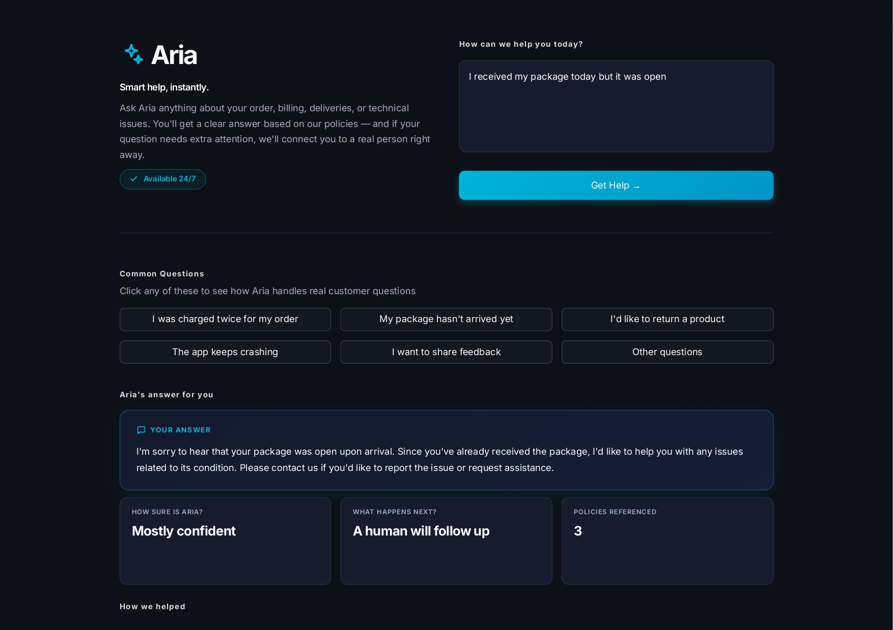

# Aria - Multi-Agent Customer Support
> Multi-agent AI customer support powered by intent classification, RAG-grounded responses, and Generator-Critic quality control. Five specialised agents collaborate via LangGraph to deliver accurate, policy-compliant customer responses with full audit trails.



## Problem

Traditional AI customer support systems make a critical mistake: they trust a single LLM call to handle classification, retrieval, response generation, and quality checking simultaneously. This leads to confident hallucinations the AI promising refunds outside policy, inventing timelines, or applying the wrong company procedure to a customer's question.

Aria solves this with a multi-agent architecture where each agent has one focused responsibility, confidence is tracked at every decision point, and the system explicitly knows when to escalate to a human.

- **Confidence-calibrated intent classification** — Pydantic-validated structured outputs with explicit calibration prompting
- **Confidence-first routing** — low-confidence queries escalate to humans before any action is taken
- **Intent-filtered RAG retrieval** — uses classifier output as a metadata filter to prevent semantic bleed across policy domains
- **Policy-grounded response drafting** — temperature-controlled generation constrained to retrieved policies only
- **Generator-Critic quality assurance** — second LLM pass with adversarial prompting catches hallucinations and tone mismatches
- **Provider cascade with fallback** — Groq → Ollama → mock providers ensure system resilience
- **Recording mode for testing** — captures real LLM responses as deterministic test fixtures
- **Production-grade Streamlit UI** — Inter typography, accessible focus states, agent decision trace visualisation

## Tech Stack

- **Python 3.11+**
- **LangGraph** — stateful multi-agent orchestration
- **Pydantic 2** — structured output validation
- **ChromaDB** — persistent vector store for policy retrieval
- **sentence-transformers** — embedding generation (all-MiniLM-L6-v2)
- **Groq API** — primary LLM inference (llama-3.1-8b-instant)
- **Ollama** — local fallback inference
- **Streamlit** — interactive web UI

## Setup

```bash
# Clone the repo
git clone ...
cd customer-support

# Create environment
conda create -n aria python=3.11
conda activate aria

# Install dependencies
pip install -r requirements.txt

# Configure your Groq API key (free at console.groq.com)
export GROQ_API_KEY="your-key-here"

# Run the app
streamlit run app.py
```

## Usage

```python
from orchestrator import build_workflow

workflow = build_workflow()

result = workflow.invoke({
    "customer_message": "My credit card was charged twice for the same order",
    "intent": None, "confidence": None,
    "relevant_policies": None, "sources": None,
    "draft_response": None, "final_response": None,
    "needs_human_review": None, "review_notes": None,
    "classification_reasoning": None, "escalation_reason": None
})

print(result["final_response"])
print(f"Confidence: {result['confidence']}")
print(f"Needs human review: {result['needs_human_review']}")
```

## Key Engineering Decisions

### Confidence-First Routing

The most important architectural decision in this system. Before any retrieval, drafting, or response generation, the router checks the classifier's confidence score. If confidence is below 0.5, the system escalates immediately — saving downstream LLM calls and preventing confident wrong actions from propagating through the agent chain.

This implements the principle: *low-confidence decisions are more dangerous than refusals. A confident wrong action propagates through every downstream agent. A refusal stops the system safely.*

### Generator-Critic Pattern

The drafter and reviewer use the same model with completely different prompts. The drafter is incentivised to be helpful and use retrieved policies. The reviewer is incentivised to find problems — adversarial framing produces stricter evaluation than asking the same model to critique its own output.

This pattern is borrowed from code review in software engineering: a fresh perspective with different priorities catches issues the original author missed.

### Filter-as-Trust-Boundary

The retriever uses the classifier's intent output as a ChromaDB metadata filter, constraining semantic search to the relevant policy category. Without this filter, semantically similar terms would surface chunks from unrelated policies — for example, "money back" in a refund query could retrieve complaint handling policies because both share emotional vocabulary.

### Provider Cascade

The LLM helper tries providers in order: Groq → Ollama → recorded mocks. Each provider failure logs the reason and falls through to the next. This made the system resilient to free-tier rate limits during development and demonstrates production-grade redundancy.

### Recording Mode

A `RECORD_LLM=true` environment variable captures real LLM responses to a JSON file during development. The mock provider then replays these recordings for unit tests and offline development. This solved a real workflow problem — testing agentic workflows without burning API quota — and is a pattern used by production teams.

## Known Limitations

- **Policy library is small** (5 demo policies). Production deployment would need 50-100+ policies for comprehensive coverage.
- **Single-turn interaction** — the current state schema doesn't support multi-turn conversation threading. Future work would extend the state to include message history.
- **No customer authentication** — responses are generated without account context. A production version would integrate with customer order history for personalised responses.
- **No streaming responses** — answers are returned as complete blocks. Production UX would benefit from token-by-token streaming.
- **English only** — current prompts and policies are English-language. Multi-language support would require localised prompt templates and policy translations.

## What I Learned Building This

Building Aria surfaced production lessons most tutorials skip:

1. **LLMs are notoriously bad at calibrating their own confidence.** The classifier returned 100% confidence on garbage input until I rewrote the prompt with explicit calibration rules. This is why confidence-first routing exists — even calibrated models occasionally over-confident, and the routing layer is the safety net.

2. **Infinite loops are a critical failure mode in agentic systems.** I introduced a subtle graph cycle (drafter -> retriever instead of drafter -> reviewer) that didn't crash but kept calling the LLM indefinitely. I diagnosed it by counting node invocations. Production agentic systems need explicit recursion limits and per-node call monitoring.

3. **Mock implementations must mirror real LLM behaviour faithfully.** My initial mock searched the entire prompt for keywords, which matched system instructions instead of the customer message. Tests passed; reality diverged. Mock fidelity is a real production concern.

4. **The Generator-Critic pattern catches hallucinations the generator misses.** The reviewer flagged a draft that used "a bit longer" instead of the policy-specified "48 hours" — a subtle imprecision the drafter didn't notice.

5. **Provider rate limits are a feature, not a bug, of free-tier development.** Hitting Groq's daily limit during testing forced me to build the provider cascade and recording mode. Constraints produced better architecture than I would have built without them.

## License

MIT

## Author

Sharon Odiwa
